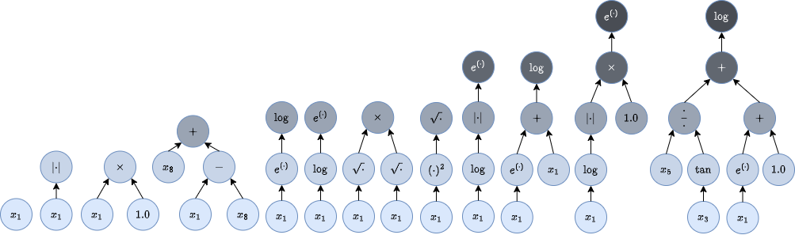

# Hashing symbolic expressions



Implementation and experiments of the paper _Inexact Simplification of Symbolic Regression Expressions with Locality-sensitive Hashing_ [(ArXiv)](https://arxiv.org/abs/2404.05898):

> Guilherme Seidyo Imai Aldeia, Fabrício Olivetti de França, and William G.
La Cava. 2024. Inexact Simplification of Symbolic Regression Expressions
with Locality-sensitive Hashing. In Genetic and Evolutionary Computation
Conference (GECCO ’24), July 14–18, 2024, Melbourne, VIC, Australia. ACM,
New York, NY, USA, 9 pages. https://doi.org/10.1145/3638529.3654147

## Introduction

Symbolic regression (SR) is a non-parametric technique for finding models that present a good balance between predictive power and model simplicity, and it is usually done with evolutionary algorithms.
Many SR algorithms have a simplification step, but a non-linear problem has infinite solutions, and simplifying these models is difficult. Simplifying a model can be as complicated as finding it in the first instance.
Instead of defining simplification rules, we can learn them during the algorithm's execution. This is done by iterating over parts of the models and learning which ones are similar enough to be considered equivalent during runtime.

> Simply put, we propose an inexact simplification algorithm that works by mapping similar expressions to the same hash, and retrieving the simplest one when doing the simplification of an expression.

## Running the experiments

1. Setup the anaconda environemnt

```bash
cd hashing-symbolic-expressions
conda env create -f environment.yml
```

2. Activate the environment

```bash
conda activate hashing-experiments
```

3. Run the experiment. Easiest way to do it is to run

```bash
bash run.sh
```

-----

## Paper abstract 

> Abstract: Symbolic regression (SR) searches for parametric models that accurately fit a dataset, prioritizing simplicity and interpretability.
Despite this secondary objective, studies point out that the models are often overly complex due to redundant operations, introns, and bloat that arise during the iterative process, and can hinder the search with repeated exploration of bloated segments.
Applying a fast heuristic algebraic simplification may not fully simplify the expression and exact methods can be infeasible depending on size or complexity of the expressions.
We propose a novel agnostic simplification and bloat control for SR employing an efficient memoization with locality-sensitive hashing (LHS).
The idea is that expressions and their sub-expressions traversed during the iterative simplification process are stored in a dictionary using LHS, enabling efficient retrieval of similar structures. 
We iterate through the expression, replacing subtrees with others of same hash if they result in a smaller expression. 
Empirical results shows that applying this simplification during evolution performs equal or better than without simplification in minimization of error, significantly reducing the number of nonlinear functions.
This technique can learn simplification rules that work in general or for a specific problem, and improves convergence while reducing model complexity.
